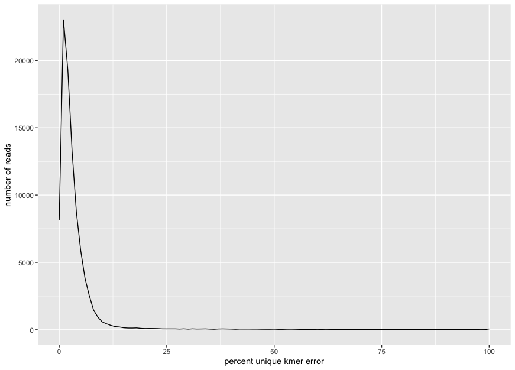

# Counting False Uniq-mers

This package contains scripts to evaluate the number of surviving and false uniqmers in simulated nanopore reads

## Dependencies
- canu
- bedtools

## Quick run
### Inputs
- **Original Reference Fasta**: the fasta file containing the full target sequence. Henceforth will be refered to as the reference
`chr22.fasta`
- **Unique Meryl Database**: A meryl database containing uniqmers, with their corresponding value as their positions in the reference fasta mentioned above. Refer to `db/make_unique_db.sh` 
`chr22.uniq_pos.meryl`
- **Simulated Reads Fasta**: an uncompressed fasta file of reads derived from the same reference above
`chr22.sim_reads.fasta`
- **Original Reads position bedfile**: bedfile containing the simulated reads (mentioned above) and their true coordinates in the reference
```
# Formatting Example
chr22   10000   12000   chr22_10000_12000_+
chr22   2500    3450    chr22_2500_3450_+
...
```
- *Prefix*: Used for tracking and naming output files (ex. `chr22`)


### Command

```
python /path/to/script/false_uniq_analysis.sh <Original Reference Fasta> <Unique Meryl Database> <Simulated Reads Fasta> <Original Reads Position Bedfile> <Prefix>

# Example
python ./false_uniq_analysis.sh chr22.sh chr22.uniq_pos.meryl/ chr22.sim_reads.fasta chr22.sim_reads.bed chr22
```

### Outputs
- **Simulated Reads Dump File** `${prefix}.sim_reads.uniqmers.dump.txt`: Filtered output of meryl-lookup kmers in the simulated reads in the Unique Meryl Database
- **Simulated Read Uniqmer Counts** `${prefix}.sim_reads.sim_read_true_false_uniqmer_count.txt` : file containing the read, the number of true and false uniqmers in tab-delimited columns
```
# read   true_count   false_count
chr22_10000_12000_+   200     4
```
- **Origin Reads Fasta file** `${prefix}.origin_reads.fasta`: Fasta file of the original locations the Simulated Reads originated from in the reference

- **Origin Reads Dump File** `${prefix}.origin_reads.uniqmers.dump.txt`: Filtered output of meryl-lookup kmers in the original version of the simulated reads in the Unique Meryl Database
- **Origin Reads True Uniqmer Counts** `${prefix}.sim_reads.sim_read_true_uniqmer_count.txt`: file containing the read and the number of uniq-mers in the reads, tab-delimited
```
# read   true_count
chr22_10000_12000   400
```
- **Compiled Uniq-mer Counts** `${prefix}.reads_compiled_uniqmer_counts.txt` : Concatenating the columns from the uniq-mer counts from the simulated and origin read uniq-mer count files
```
# read   true_count   false_count   origin_count
chr22_10000_12000_+   200     4     400
```

- **Uniqmer Loss Table** `${prefix}.uniqmer_loss.to_plot.txt`: Table that calculates the total number of uniq-mers in each simulated read, and compares it to the true number of kmers. Produces following dot plot.

```
# read   sim_count   origin_count
chr22_10000_12000_+   204     400
```


- **Uniqmer False Uniq-mer Rate Table** `${prefix}.false_uniqmer_rate.to_plot.txt` : Table to calculate the proportion of the uniq-mers found in a simulated read that are false. Produces this frequency histogram. 
```
# read   Error
chr22_10000_12000_+   .02   # 4/200
```
