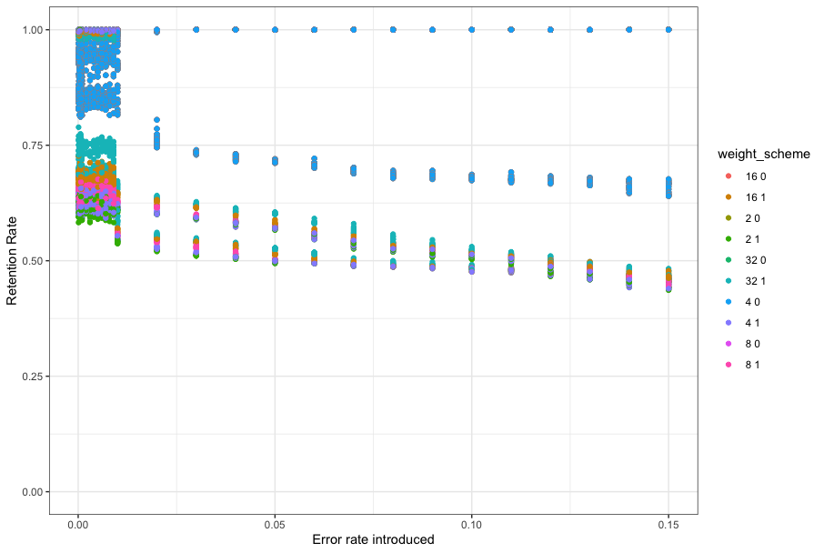

# Simulation on the GAGE locus
To test the effects of variable error rates, we simulated random error in one half of the GAGE locus, and then realigned simulated reads back onto this new GAGE locus.


## Inputs
Steps 1 - 2 : Evaluate Minimap2
- **GAGE_A reference fasta** : Fasta file to part A of GAGE or of target sequence
- **GAGE_B reference fasta** : Fasta file to part B of GAGE or of target sequence
- **GAGE_A Simulated reads fasta** : Simulated reads originating from GAGE_A reference sequence
- **GAGE_B Simulated reads fasta** : Simulated reads originating from GAGE_B reference sequence
- **Error Rate Start** : Starting error rate to introduce
- **Error Rate End** : Ending error rate to introduce
- **Error Rate Step** : Increments of error rates to test between the Start and End error rates
- **Iterations** : Number of times to test at each error rate
- **Prefix** : The run name to track files
- **Script path** : Path to the script `test_alignment_on_sim_errors.sh`

Step 3 : Evaluate Weighted Jaccard
- **Errors String** : String of the error rates to evaluate, comma delimited (no spaces). Ensure that the errors listed exist as directories in the form `error_<error rate>/`. 
- **Prefix** : The run you want to evaluate (ie pick the one you used above)
- **Uniqmer Weights list** : String comma delimited (no spaces) list of the weights to try on uniqmers
- **Non-uniqmer Weights list** : String comma delimited (no spaces) list of the weights to try on non-uniqmers

## Commands
```
# 1.) Simulate errors and create alignments

python /path/to/weighted_jaccard/simulate_error_main.py <GAGE_A> <GAGE_B> <GAGE_A_reads> <GAGE_B_reads> <Error start> <Error end> <Error step> <Iterations> <prefix> /path/to/test_alignment_on_sim_errors.sh

  # Example
  # python /path/to/weighted_jaccard/simulate_error_main.py GAGE_A.fasta GAGE_B.fasta GAGE_A.sim_reads.fasta GAGE_B.sim_reads.fasta 0.0 0.15 0.1 10 XXX /path/to/test_alignment_on_sim_errors.sh

# 1_alt.) To run the simulation on a single condition (like only introduce errors to GAGE_A at only 0.1 error rate)

/path/to/test_alignment_on_sim_errors.sh <GAGE_A> <GAGE_B> <Which to error ("A" or "B")> <Which NOT to error ("A" or "B")> <Error rate> <Iterations> <GAGE_A_reads> <GAGE_B_reads> <prefix> 

  # Example
  /path/to/test_alignment_on_sim_errors.sh GAGE_A.fasta GAGE_B.fasta A B 0.1 5 GAGE_A.sim_reads.fasta GAGE_B.sim_reads.fasta XXX

# 2.) Evaluate the output files from minimap2

python /path/to/sim_error_eval.py <File of file paths to all the out files> > <minimap2 Performance Percentage>.to_plot

# 3.) Evaluate the weighted Jaccard approach on the alignment files produced from Step 1

python /path/to/weighted_jaccard_sam_input_k_count.py <Errors String> <Prefix> <Uniq weights> <non-uniq weights> > <Weighted Jaccard Performance Count>

  # Example
  python /path/to/weighted_jaccard_sam_input_k_count.py 0,0.1,0.2,0.3,0.4,0.5,0.6 XXX 1,2,4,8 0,1 > weighted_jaccard_performance.txt
  
# 4.) Plot

cat <Weighted Jaccard Performance Count> | grep "GAGE" | awk '{print $1"\t"($2/($2 + $3))"\t"$5"\t"$6"\t"$7"\t"$8}' > <Weighted Jaccard Performance Percentage>.to_plot.txt


Rscript /path/to/plot_sim_error_weighted_jaccard.R <Weighted Jaccard Performance Percentage>.to_plot.txt
Rscript /path/to/plot_sim_error_minimap2.R <minimap2 Performance Percentage>.to_plot.txt

```

## Outputs
Step 1:
- **Error rate directories** : Each error rate will get it's own directory in the form `error_<error rate>/`. For each iteration `${counter}`:
- **Errored fasta file** : Fasta file of the part that we introduce error to. In the form `${prefix}.err_${error_rate}_${which_to_error}.v_${counter}.fasta`
- **Split Target fasta file** : Concatenated target fasta with the fasta record of the Part with no error and the fasta record of the Errored Part fasta file. In the form `${prefix}_split.err_${error_rate}_${which_to_error}.v_${counter}.fasta`
- **Part A alignment file** : minimap2 alignment of reads from A onto the **Split Target fasta file** with parameters `-N50 -r3000`. In the form `${prefix}_minimap2.N50_r3k.split.err_${error_rate}_${which_to_error}.v_${counter}.aligned_A.sam`
- **Part B alignment file** : minimap2 alignment of reads from B onto the **Split Target fasta file** with parameters `-N50 -r3000`. In the form `${prefix}_minimap2.N50_r3k.split.err_${error_rate}_${which_to_error}.v_${counter}.aligned_B.sam`
- **Performance Out file** : Documents the how many reads from what part mapped where for the corresponding error rate. In the form `${prefix}.err_${error_rate}_${which_to_error}.out`
  1. Error rate
  2. Which Part Errored 'A/B'
  3. Number of reads from A aligned to Part A
  4. Number of reads from A aligned to Part B
  5. Number of reads from B aligned to Part B
  6. Number of reads from B aligned to Part A
  7. Number of read from A unaligned
  8. Number of reads from B unaligned
  9. Part A alignment file name : For tracking purposes
  10. Part B alignment file name : For tracking purposes 

Step 2:
- **minimap2 performance percentage** : Text file documenting the performance for each error rate
  1. Error rate
  2. Retention Rate: Percentage of reads from column 5 mapping to the correct part (ex. Percentage of reads from Part A mapping back to Part A)
  3. Which part was Errored ("GAGE_A")
  4. Reads from which part was aligned
  
Step 3:
- **Weighted Jaccard Performance** : Text file documenting the performance of each weighting scheme for each error rate for each iteration
  1. Error rate
  2. Correct count : The number of reads from column 6 that were mapped to the correct part
  3. Incorrect count : The number of reads from column 6 that were mapped to the incorrect part
  4. Unmapped count : The number of reads without an alignment
  5. Which part was errored : GAGE_A or GAGE_B
  6. Reads from which part was aligned : GAGE_A or GAGE_B
  7. Unique Kmer weight
  8. Non-unique kmer weight
  9. Corresponding Sam file (For tracing)

Step 4:
- **Weighted Jaccard Performance Percentage** : Text file containing information on the performance on each error rate for each weighting scheme
  1. Error rate
  2. Retention Rate (0 - 1): Number of reads in column 4 mapped to the correct part
  3. Which part errored
  4. Reads from which part aligned
  5. Uniq-mer weight
  6. Non-uniq-mer weight
- **Plots!** : In the form `*.plot_sim_error_minimap2.png` or `*.plot_sim_error_weighted_jaccard.png`. Enough information are in the above plots to compare the two, view specific weights, etc. 


