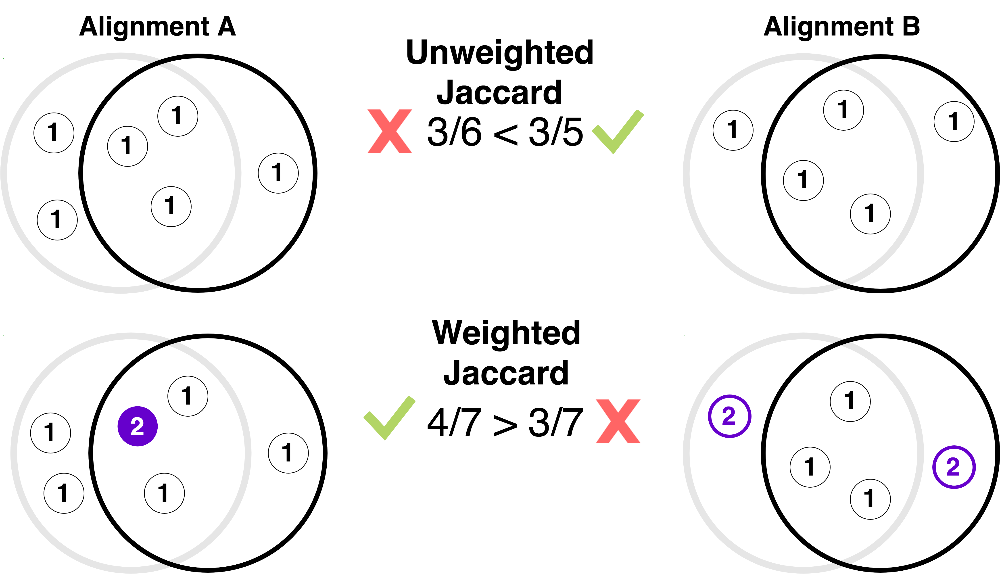

# Weighted Jaccard Testing
This collection of scripts calculates and evaluates the performance of a weighted Jaccard Scheme to select the correct alignment.



# Dependencies
- canu
- bedtools
- minimap2 or mashmap

# Using an existing reference
This section consists of the following steps:
1. Parsing an alignment file (BAM or mashmap output)
2. Evaluating mapper
3. Evaluating performance of multiple weighting schemes
4. Comparing performance

## Inputs
- **Target Fasta** : The target (or reference) that will be use to simulate nanopore reads and mapped onto by said simulated reads 
- **Simulated Reads Fasta** : simulated nanopore reads with fasta headers indicating their original start and end position in the reference
- **Simulated Reads True Positions bedfile** : Bedfile with the original positions of each simulated read
```
# Origin_seq    start   end   read_name
chr22   2000    8000    chr22_2000_8000_+
```
## Outputs


# Simulation on the GAGE locus
To test the effects of variable error rates, we simulated random error in one half of the GAGE locus, and then realigned simulated reads back onto this new GAGE locus.


## Inputs

## Outputs
