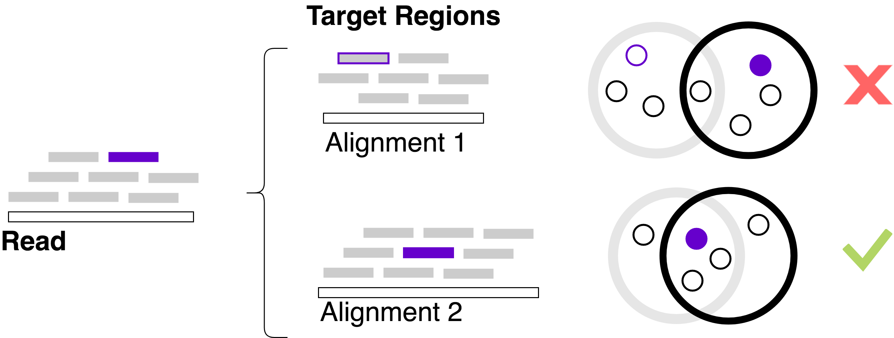
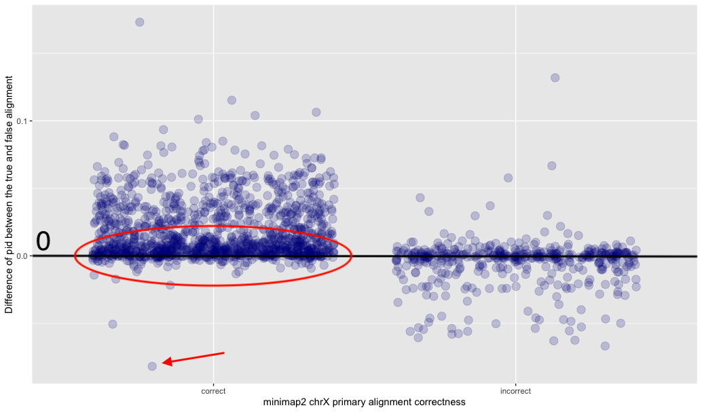

# Weighted Jaccard Testing
This collection of scripts calculates and evaluates the performance of a weighted Jaccard Scheme to select the correct alignment.

To test this idea, I took existing alignments for each read from minimap2 or mashmap, and then used the weighted jaccard index to pick the alignment with the highest score as the new primary read 

# Dependencies
- canu
- bedtools
- minimap2 or mashmap
- samtools

# Multiple Approaches and Analysis

## Testing multiple alignments

Go to the `weighted_jaccard_test` folder.
This is a pure implementation of the second picture above. It includes the following steps.

### Steps
0. (Optional) Filter alignments to only get reads where they have multiple to pick from. Refer to the Format package. 
1. **Ground Truth** : Append the ground truth to the end of each alignment line
2. **Counting k-mers** Count the shared/non-shared unique/non-unique k-mers between the read and it's candidate alignment region
3. **Scheme Scores** : Get the scores of each alignment using different weighting schemes on the above k-mer counts
4. **Evaluate Performance** : Determine which weight gives the best performance

 

## Comparing difference in percent identity
To see the potential effects of variable percent identity between a read and its multiple candidate alignments, I calculate the percent ID for each alignment. Then for each mapping method, I compared the percent ID between the mapper's "primary" alignment and the true alignment (if said primary alignment was false), or the second best alignment (if the primary alignment was already true to begin with). If I had the time to redo this, I would instead compare the percent identity of the primary alignment and the true alignment to calculate that difference. 

Optional, but you can just analyze reads with multiple alignments. Refer to the Format folder for more info.

### Steps
1. Append the percent identity for each alignment
2. Evaluate each read's primary alignment's correctness and difference in percent identity with the second best alignment
3. Run the **Testing Multiple Alignments** section on the alignment file + percent identity. 
4. Evaluate the performance of the weighted jaccard method by selecting **ONE** scheme. 

The plot below only considered reads where at least one of it's alignments are True.

## Simulation on the GAGE locus
To test the effects of variable error rates, we simulated random error in one half of the GAGE locus, and then realigned simulated reads back onto this new GAGE locus. To evaluate performance, we looked the the retention rate, or the number of reads from (wlog) part A still mapping to part A after we introduce random error to either part A or part B.

### Steps
1. Simulate errors and make the alignment files using minimap2 -N50 -r3000 (hard-coded)
2. Evaluate minimap2 performance
3. Evaluate the weighted Jaccard approach with different schemes. 

